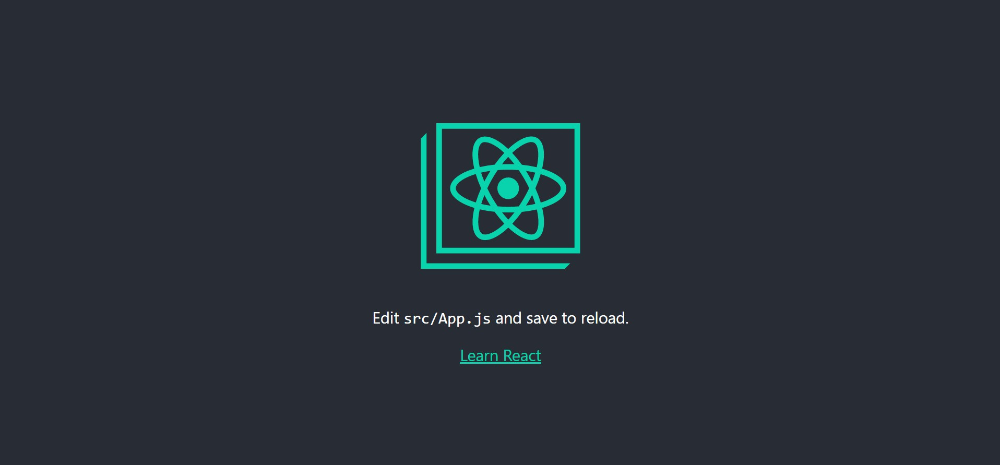
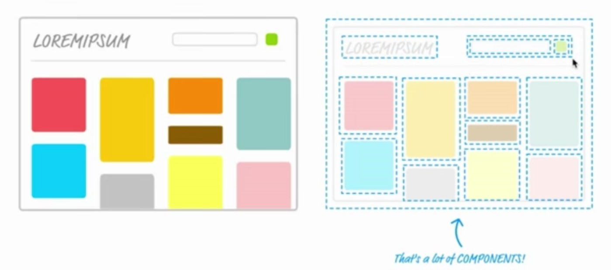

# React开发准备工作

[TOC]

## 一. Reactjs开发环境搭建

### 1. 引入`.js`文件来使用React

### 2. 通过脚手架工具来搭建

> - 官方脚手架工具：Create-react-app
> - 其它脚手架工具：Webpack，gulp，Grant
> - 这里我们只介绍 `Create-react-app` 官方推荐的脚手架工具来搭建项目

**开发环境搭建步骤：**

1. 安装：

   ~~~shell
   npm install -g create-react-app
   ~~~

2. 创建项目

   ~~~shell
   npx create-react-app 项目名
   ~~~

3. 进入项目并启动

   ~~~shell
   cd 项目名
   npm start
   ~~~

   运行成功即可看到如下界面

   

## 二. 工程目录简介

~~~shell
├─hello-world-demo
|        ├─.gitignore
|        ├─README.md
|        ├─src
|        |  ├─App.css
|        |  ├─App.js
|        |  ├─App.test.js
|        |  ├─index.css
|        |  ├─index.js
|        |  ├─logo.svg
|        |  └serviceWorker.js
|        ├─public
|        |   ├─favicon.ico
|        |   ├─index.html
|        |   ├─logo192.png
|        |   ├─logo512.png
|        |   ├─manifest.json
|        |   └robots.txt
|        ├─node_modules
~~~

- **.gitignore：**使用git的时候，用来忽略需要上传的文件的配置文件
- **README.md：**项目的说明文件
- **package.json：**node的包文件
- **src：**项目的所有源代码文件
  - index.js：项目的入口文件
  - App.js：入口组件
- **public：**
  - index.html：入口页面
  - favicon.ico：网页titile旁边的图标
- **node_modules：**第三方模块

## 三. React中的组件

- 每一个页面可以都可以看作是由一个个的小组件组成的

## 四. 基础的JSX语法

- 在js里面写 HTML标签，我们就把这种称为JSX语法
- 在JSX语法中，如果我们需要使用自定义的组件，组件引入和使用的时候，必须以大写字母开头

~~~js
import App from './App';

ReactDOM.render(<App />, document.getElementById('root'));
~~~

