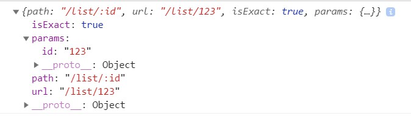

# React-Router基本使用

[TOC]

## 1. 安装

~~~shell
npm i react-router-dom -S
~~~

## 2. 基本使用

1. 引入

   ~~~js
   import { BrowserRouter as Router,Route, Link } from 'react-router-dom'
   ~~~

2. 在 UI 最外层添加 <Router>标签

   ~~~js
   render(){
       return(
       	<Router>
           
           </Router>
       )
   }
   ~~~

3. 添加路由跳转链接

   - 使用<Link>指定跳转链接
   - 通过<Route>指定跳转的目的组件
   - 注意：<Link>标签中的每一个 to 指向的地址，必须匹配到 <Route>标签中的 path 属性

   ~~~js
    render() {
           return (
               <Router>
                   <ul>
                       <li><Link to='/login'>登陆</Link></li>
                       <li><Link to='/register'>注销</Link></li>
                   </ul>
                   <Route path='/login' component={ Login }></Route>
                   <Route path='/register' component={ Register }></Route>
   
               </Router>
            );
       }
   ~~~

4. 完整代码

   ~~~js
   import React, { Component } from 'react';
   import { BrowserRouter as Router,Route, Link } from 'react-router-dom'
   
   function Login(props){
       return <h1>登陆成功</h1>
   }
   
   function Register(props){
       return <h1>账号已注销</h1>
   }
   
   class AppRouter extends Component {
       constructor(props) {
           super(props);
           this.state = {  }
       }
       render() {
           return (
               <Router>
                   <ul>
                       <li><Link to='/login'>登陆</Link></li>
                       <li><Link to='/register'>注销</Link></li>
                   </ul>
                   <Route path='/login' component={ Login }></Route>
                   <Route path='/register' component={ Register }></Route>
   
               </Router>
            );
       }
   }
   
   export default AppRouter;
   ~~~

   

## 3. 传参

> 我们可以在路由后面指定要接收的参数，然后通过 this.props.match.params来获取参数对象

- 如下，我们为 `/list` 路由，添加了一个 `id` 的入参

~~~js
<Router>
    <ul>
    	<li><Link to='/'>主页</Link></li>
        <li><Link to='/list/123'>List列表</Link></li>
    </ul>
    <Route path='/' exact component={ Index }></Route>
    <Route path='/list/:id' component={ List }></Route>
</Router>
~~~

- 在 List 组件中，我们可以这样获取入参

~~~js
// List.js 

componentDidMount(){
    console.log(this.props.match)
}
~~~

## 4. 重定向

> 重定向可以氛围两类
>
> - **标签式重定向：**利用 <Redirect>标签重定向，业务逻辑不复杂时建议这样使用
> - **编程式重定向：**利用编程的方式，一般用于业务逻辑当中
>
> **注意：跳转和重定向有一个区别，就是跳转可以通过浏览器的回退按钮返回上一级，而重定向是不可以的**

### 4.1 标签式重定向

- 示例：通过 Index组件重定向到 Home组件

~~~js
//Index.js
// 在 Index组件中引入 Redirect,通过 Redirect组件重定向到 Home组件的路由地址

import React, { Component } from 'react';
import { Link, Redirect } from 'react-router-dom'

class Index extends Component {
    constructor(props) {
        super(props);
        this.state = { }
    }
    render() {
        return (
            <Redirect to="/home" />
         );
    }
}

export default Index;
~~~

- 通过 Route 标签定义 Home 组件的路由，Redirectt 中重定向的地址应该和此处 Home的路由地址一致

~~~js
// AppRouter.js
// 定义 Home 的路由组件，重定向后将跳转到此处定义的组件

import React, { Component } from 'react';
import { BrowserRouter as Router,Route, Link } from 'react-router-dom'
import Index from './components/Index'
import List from './components/List'
import Home from './components/Home'

class AppRouter extends Component {
    constructor(props) {
        super(props);
        this.state = {  }
    }
    render() {
        return (
            <Router>
                <ul>
                    <li><Link to='/'>主页</Link></li>
                    <li><Link to='/list/123'>List列表</Link></li>
                </ul>
                <Route path='/' exact component={ Index }></Route>
                <Route path='/list/:id' component={ List }></Route>
                <Route path="/home" component={ Home }></Route>
            </Router>
         );
    }
}

export default AppRouter;
~~~

### 4.2 编程式重定向

> 编程式重定向就更简单了，还是用上述的例子，直接在 Index组件的构造呢函数中加上 `this.props.history.push("/home/")`即可

- 示例：通过 Index组件重定向到 Home组件
- 直接在constructor 构造函数中添加 `this.props.history.push("/home/")`即可

~~~js
import React, { Component } from 'react';

class Index extends Component {
    constructor(props) {
        super(props);
        this.state = { }

        this.props.history.push("/home/")
    }
    render() {
        return (
            <ul>
                {
                    this.state.list.map((item,index)=>{
                        return (
                            <li key={index}>
                                <Link to={'/list/' + item.id}>{item.title}</Link>
                            </li>
                        )
                    })
                }
            </ul>
         );
    }
}

export default Index;
~~~

~~~js
// AppRouter.js
// 定义 Home 的路由组件

import React, { Component } from 'react';
import { BrowserRouter as Router,Route, Link } from 'react-router-dom'
import Index from './components/Index'
import List from './components/List'
import Home from './components/Home'

class AppRouter extends Component {
    constructor(props) {
        super(props);
        this.state = {  }
    }
    render() {
        return (
            <Router>
                <ul>
                    <li><Link to='/'>主页</Link></li>
                    <li><Link to='/list/123'>List列表</Link></li>
                </ul>
                <Route path='/' exact component={ Index }></Route>
                <Route path='/list/:id' component={ List }></Route>
                <Route path="/home" component={ Home }></Route>
            </Router>
         );
    }
}

export default AppRouter;
~~~

------

- **上述笔记完整代码Demo：**[Github-react-router-demo](https://github.com/mapengfei47/React-Notes/tree/master/ReactDemo/react-router-demo)

## 5. 路由嵌套

> 路由的嵌套大致如下面两步所示

**第一步：**

- 编写二级路由

- 注意1：`ReactPage，Flutter，Vue` 组件都为  `Video.js` 同级目录下的 `video`文件夹下的组件

- 注意2：二级路由需要体现层级关系，注意路由路径的配置

  ~~~js
  // Video.js
  
  import React from 'react';
  import { Route, Link } from 'react-router-dom'
  import ReactPage from './video/ReactPages'
  import Flutter from './video/Flutter';
  import Vue from './video/Vue';
  
  function Video(){
      return (
          

              

                  <ul>
                      <li><Link to="/video/reactpage">React教程</Link></li>
                      <li><Link to="/video/flutter">Flutter教程</Link></li>
                      <li><Link to="/video/vue">Vue教程</Link></li>
                  </ul>
              

              

                  
<h3>视频教程</h3>

                  <Route path="/video/reactpage" component={ReactPage} />
                  <Route path="/video/flutter" component={Flutter} />
                  <Route path="/video/vue" component={Vue} />
              

          

      )
  }
  
  export default Video
  ~~~

**第二步：**

- 将二级路由加入主组件

  ~~~js
  // AppRouter.js
  
  import React, { Component } from 'react';
  import { BrowserRouter as Router, Route, Link } from 'react-router-dom'
  import './index.css'
  import Index from './Pages/Index'
  import Video from './Pages/Video'
  import WorkSpace from  './Pages/WorkSpace'
  
  
  class AppRouter extends Component {
      constructor(props) {
          super(props);
          this.state = {  }
      }
      render() {
          return (
              <Router>
                  

                      

                          <h3>一级导航</h3>
                          <ul>
                              <li><Link to="/">博客首页</Link></li>
                              <li><Link to="/video">视频教程</Link></li>
                              <li><Link to="/workspace">职场技能</Link></li>
                          </ul>
                      

                      

                          <Route path="/" exact component={ Index } />
                          <Route path="/video" component={ Video } />
                          <Route path="/workspace" component={ WorkSpace } />
                      

                  

              </Router>
           );
      }
  }
  
  export default AppRouter;
  ~~~

## 6. 动态获取路由进行配置

> 下面Demo，我们模拟实际开发中，动态获取路由进行配置的过程
>
> 最主要的步骤就是，通过动态获取的数据，动态的渲染 <Link>和 <Route>标签

~~~js
// AppRouter.js

import React, { Component } from 'react';
import { BrowserRouter as Router, Route, Link } from 'react-router-dom'
import './index.css'
import Index from './Pages/Index'
import Video from './Pages/Video'
import WorkSpace from  './Pages/WorkSpace'

class AppRouter extends Component {
    constructor(props) {
        super(props);
        this.state = {  }
    }
    render() {
        let routerConfig = [
            {path:'/',title:'博客首页',exact:true,component:Index},
            {path:'/video',title:'视频教程',exact:false,component:Video},
            {path:'/workspace',title:'职场技能',exact:false,component:WorkSpace}
        ]
        return (
            <Router>
                

                    

                        <h3>一级导航</h3>
                        <ul>
                            {
                                routerConfig.map((item,index)=>{
                                    return (<li key={index}><Link to={item.path}>{item.title}</Link></li>)
                                })
                            }
                        </ul>
                    

                    

                        {
                            routerConfig.map((item,index)=>{
                                return (<Route key={index} path={item.path} exact={item.exact} component={ item.component } />)
                            })
                        }
                    

                

            </Router>
         );
    }
}

export default AppRouter;
~~~

~~~js
// Video.js
import React from 'react';
import { Route, Link } from 'react-router-dom'
import ReactPage from './video/ReactPages'
import Flutter from './video/Flutter';
import Vue from './video/Vue';

function Video(){
    return (
        

            

                <ul>
                    <li><Link to="/video/reactpage">React教程</Link></li>
                    <li><Link to="/video/flutter">Flutter教程</Link></li>
                    <li><Link to="/video/vue">Vue教程</Link></li>
                </ul>
            

            

                
<h3>视频教程</h3>

                <Route path="/video/reactpage" component={ReactPage} />
                <Route path="/video/flutter" component={Flutter} />
                <Route path="/video/vue" component={Vue} />
            

        

    )
}

export default Video
~~~

~~~js
// WorkSpace.js
import React from 'react';
import { Route, Link } from 'react-router-dom'
import Code from './workSpace/Code'
import GetUp from './workSpace/GetUp'
import Money from './workSpace/Money'

function WorkSpace(){
    return (
        

            

                <ul>
                    <li><Link to="/workspace/money">关于赚钱</Link></li>
                    <li><Link to="/workspace/getup">关于起床</Link></li>
                    <li><Link to="/workspace/code">关于代码</Link></li>
                </ul>
            

            

                
<h3>职场技能你知道？</h3>

                <Route path="/workspace/money" component={Money} />
                <Route path="/workspace/getup" component={GetUp} />
                <Route path="/workspace/code" component={Code} />
            

        

    )
}

export default WorkSpace
~~~

- **路由的嵌套完整代码Demo：**[GitHub-react-router-demo-02](https://github.com/mapengfei47/React-Notes/tree/master/ReactDemo/react-router-demo-02)