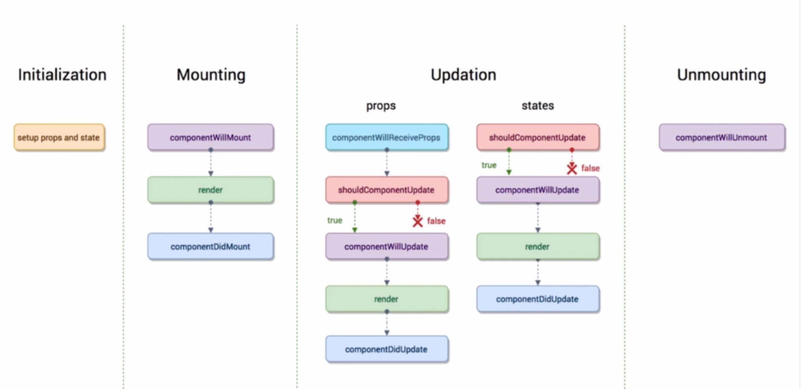

# React生命周期

> 生命周期：在React组件**初始化到销毁**过程中会自动执行的一些函数称为生命周期

**生命周期图示：**

由图可知，生命周期可分为如下四个阶段

1. Initialization：初始化阶段
2. Mounting：挂载阶段
3. Updation：更新阶段
4. Unmounting：卸载阶段

## 一. Initialization 初始化阶段

## 二. Mounting 挂载阶段

> 挂载阶段将会按照顺序执行如下三个函数
>
> 1. `componentWillMount`：组件将要挂载
> 2. `render`：组件渲染函数
> 3. `componentDidMount`：组件挂载结束

**注意：`componentWillMount` 和 `componentDidMount` 这两个生命周期函数，只在页面刷新的时候执行一次，二 `render` 函数，只要有 `props` 和 `state` 变化就会**

## 三. Updation 更新阶段

> 更新阶段是React生命周期中相对比较复杂的一个阶段，它包含两个基本的部分
>
> - props属性改变
> - state状态改变

我们观察最上面图片可以发现，对于 props 属性改变和 state 属性改变所执行的生命周期方法，他们只有一点不同，props属性多一个 `componentWillReceiveProps` 方法，该方法只有在接收 props属性的子组件中才会被执行，在没有接收props属性的组件中是不会被执行的

> **生命周期执行流程：**
>
> 1. `componentWillReceiveProps`：只在接收props的子组件中生效
>    - 该组件第一次存在于Dom中，函数是不会执行的（即组件第一次渲染的时候，是不会被执行的）
>    - 如果已经存在于Dom中，函数才会执行，即后续每次render函数执行之前都会执行该函数
>    -  参数：nextProps
> 2. `shouldComponentUpdate`：返回一个布尔值，为 true的时候才会继续执行，否则后续的不再执行
>    - 两个参数：
>    - nextProps：变化后的属性
>    - nextState：变化后的状态
> 3. `componentWillUpdate`：组件更新之前执行
>    - 两个参数：
>    - nextProps：变化后的属性
>    - nextState：变化后的状态
> 4. `render`：渲染函数
> 5. `componentDidUpdate`：组件更新之后执行，这是组件更新的最后一个环节
>    - 两个参数
>    - preProps：改变之前的属性
>    - preState：改变之前的状态

## 四. componentWillUnmount 卸载阶段

> `componentWillUnmount` 函数在组件将要被卸载之前执行，也就是组件删除之前执行

## 五. 生命周期改善程序性能

> 默认情况下，我们每次做数据更新，React都会频繁的调用render函数，影响页面性能
>
> 为了避免无用的页面渲染，我们可以通过在 `shouldComponentUpdate`生命周期函数中加一层数据校验，只有符合我们要求的数据，才可以进行后续的渲染操作（返回true），否则返回false，终止后续的操作

**片段示例：**

~~~js
//具体判断条件可根据业务需求，进行设置
shouldComponentUpdate(nextProps,nextState){
    if(...){
       return true
    }else{
        return false
    }
}
~~~

