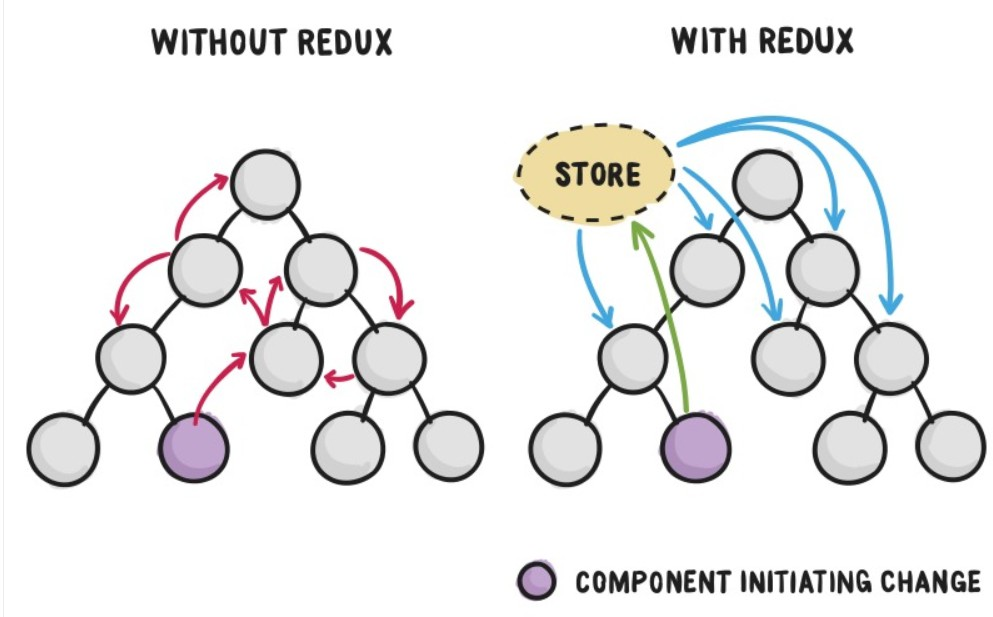
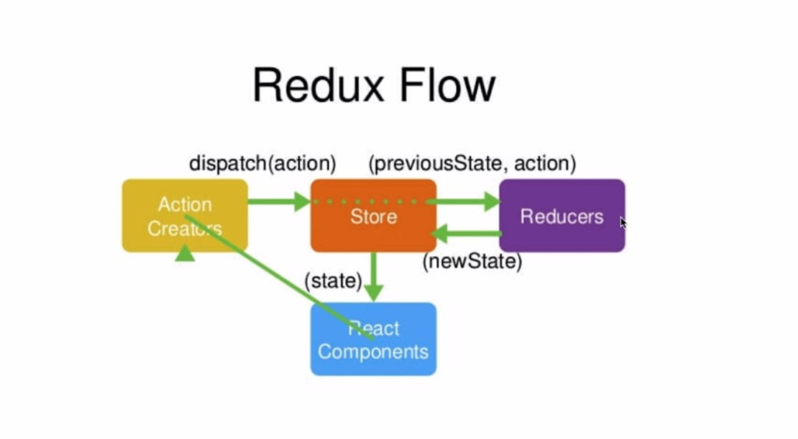

# sRedux基本介绍

[TOC]

## 一. Redux是什么

- Redux是React的状态管理工具，用来使我们方便简洁的操作React中组件的各种状态
- 我们通过如下一张图，来理解Redux在项目中的作用

- 我们将组件之间的状态统一交给Redux的 `store`管理，依赖store来进行组件状态的修改和变更，同时反映到所有组件上面去

## 二. Flux 和 Redux的关系

> **Redux** 就是 **Flux** 的升级版，早期我们使用**React**的时候，需要配合 **Flux** 进行状态的管理，但是使用过程中，发现 **Flux** 存在很多问题，所以 **Redux** 就诞生了，

## 三.  Redux工作流程

- 我们先来看一下Redux官方对Redux工作流的介绍

**解读：**

- 组件需要改变状态的时候，需要执行如下流程

1. react要改变 store 里面的状态，需要先开发一个 Action，Action会通过 store.dispatch（action）传递给 store
2. store会把之前的 state 和 action 转发给 Reducers
3. Reducers 是一个函数，接受到 state 和 action，做一些处理之后，返回一个新的 state给 store
4. store 用新的state替换掉旧的 state
5. store 改变之后，react会感知 store的变化，从store里面重新获取数据，更新组件

**redux三个原则**

1. store是唯一的
2. 只有store能改变自己的内容
3. reduce 必须是纯函数（给定固定的输入，就会得到固定的输出，而且不会有副作用）