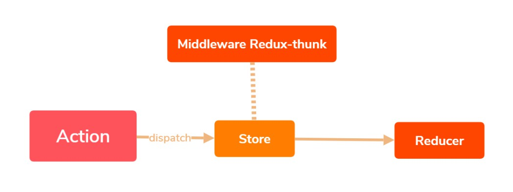

# Redux基本进阶

## 一. 组件UI和业务逻辑的拆分

> **问题描述：**回顾我们之前的 todoList 我们可以发现，组件UI和业务逻辑的代码都包含在同一个js文件里面，在项目中不利于多人的合作和项目的维护，同时增加了组件的耦合性
>
> **解决方法：**将组件的UI部分和业务逻辑部分分开，分别拆分到不同的文件里面

- 我们以以下文件为例子，进行拆分的演示

~~~js
// TodoList.js
import React, { Component } from 'react';
import 'antd/dist/antd.css'
import { Input, Button, List } from 'antd'
import { CHANGE_INPUT_VALUE, VALUE_SUBMIT, DELETE_ITEM } from './store/actionTypes'
import { changeInputValueAction, valueSubmitAction, dleteItemAction, deleteItemAction } from './store/actionCreators'
import store from './store'

class TodoList extends Component {
    constructor(props) {
        super(props);
        this.state = store.getState()
        this.inputChange = this.inputChange.bind(this)
        this.storeChange = this.storeChange.bind(this)
        this.valueSubmit = this.valueSubmit.bind(this)
        store.subscribe(this.storeChange)
    }

    render() {
        return (
            

                

                    <Input
                        placeholder={this.state.inputValue}
                        style={{width:'250px',margin:'10px'}}
                        onChange={this.inputChange}
                        value={this.state.inputValue}
                    ></Input>
                    <Button
                        type="primary"
                        onClick={this.valueSubmit}
                    >添加</Button>
                

                

                    <List
                        bordered
                        dataSource={ this.state.list }
                        renderItem={(item,index) =>(<List.Item onClick={this.deleteItem.bind(this,index)}>{item}</List.Item>)}
                        ></List>
                

            

        );
    }

    inputChange(e){
        const action = changeInputValueAction(e.target.value)
        store.dispatch(action)
    }

     storeChange(){
         this.setState(store.getState())
     }

    valueSubmit(){
        const action = valueSubmitAction(this.state.inputValue)
        store.dispatch(action)
    }

    deleteItem(index){
        const action = deleteItemAction(index)
        store.dispatch(action)
    }
}

export default TodoList;
~~~

- 拆分组件 UI

~~~js
// 在同级目录下新建 TodoLisUI.js
//提取出组件的UI，并修改绑定的数据

import React, { Component } from 'react';
import 'antd/dist/antd.css'
import { Input, Button, List } from 'antd'

class TodoListUI extends Component {
    constructor(props) {
        super(props);
        this.state = {  }
    }
    render() {
        return (
            

                

                    <Input
                        placeholder={this.props.inputValue}
                        style={{width:'250px',margin:'10px'}}
                        onChange={this.props.inputChange}
                        value={this.props.inputValue}
                    ></Input>
                    <Button
                        type="primary"
                        onClick={this.props.valueSubmit}
                    >添加</Button>
                

                

                    <List
                        bordered
                        dataSource={ this.props.dataSource }
                        renderItem={(item,index) =>(<List.Item onClick={()=>{this.props.deleteItem(index)}}>{item}</List.Item>)}
                        ></List>
                

            

         );
    }
}

export default TodoListUI;
~~~

- 改写 TodoList.js

~~~js
// TodoList.js
// 1. 引入 TodoListUI，将render中返回的所有东西替换为 <TodoListUI />
// 2. 将 TodoListUI 需要的参数传递过去
import React, { Component } from 'react';
import 'antd/dist/antd.css'
import { changeInputValueAction, valueSubmitAction, deleteItemAction } from './store/actionCreators'
import store from './store'
import TodoListUI  from './TodoListUI'

class TodoList extends Component {
    constructor(props) {
        super(props);
        this.state = store.getState()
        this.inputChange = this.inputChange.bind(this)
        this.storeChange = this.storeChange.bind(this)
        this.valueSubmit = this.valueSubmit.bind(this)
        this.deleteItem = this.deleteItem.bind(this)
        store.subscribe(this.storeChange)
    }

    render() {
        return (
            <TodoListUI
                inputValue={this.state.inputValue}
                inputChange={this.inputChange}
                valueSubmit={this.valueSubmit}
                dataSource={this.state.list}
                deleteItem={this.deleteItem}
            />
        );
    }

    inputChange(e){
        const action = changeInputValueAction(e.target.value)
        store.dispatch(action)
    }

    storeChange(){
        this.setState(store.getState())
    }

    valueSubmit(){
        const action = valueSubmitAction(this.state.inputValue)
        store.dispatch(action)
    }

    deleteItem(index){
        const action = deleteItemAction(index)
        store.dispatch(action)
    }
}

export default TodoList;
~~~

## 二. Axios异步获取数据并和Redux结合

## 三. Redux-thunk中间件的使用

> **注意：**我们这里说的中间件都是 Redux的，不是 React的，不要混淆
>
> **中间件的作用：**在组件中 dispatch 一个Action之后，由于store 不具备处理能力，会直接将Action转发给 reducer。有时候，我们想要在 dispatch 之后，reducer接收之前进行一些处理，就需要用到中间件。在实际工作中常用来进行日志记录，创建崩溃报告，调用异步接口或路由等
>
> Redux-thunk 是Redux中最常用的插件

我们通过如下流程图加深理解

### 3.1 安装

> 通过 npm 可以直接安装 redux-thunk

~~~shell
npm install redux-thunk -S
~~~

### 3.2 配置

> 1. 在使用中间件之前，我们需要从 redux 中引入 `applyMiddleware`
>
> 2. 引入redux-thunk
> 3. 将 `applyMiddleware(thunk)`当作 `createStore()`的第二个参数传入即可

**示例：**

~~~js
import { createStore, applyMiddleware } from 'redux'
import reducer from './reducer'
import thunk from 'redux-thunk'

const store = createStore(
    reducer,
    applyMiddleware(thunk)
)

export default store
~~~

注意：我们在之前的学习 Redux DevTools工具的时候，也需要在 `createStore（）`的第二个参数位置传递一个参数，否则Redux DevTools将无法使用，这时候，就跟中间件产生了冲突

**解决方法：**

- Redux 为我们提供了一个 compose 方法，用来增强函数，来达到一个链式调用的目的

1. 引入 compose 方法
2. 创造增强函数（链式函数）
3. 将thunk 加入增强函数，这样两个函数都会执行

~~~js
import { createStore, applyMiddleware, compose } from 'redux'
import reducer from './reducer'
import thunk from 'redux-thunk'

const composeEnhancers = window.__REDUX_DEVTOOLS_EXTENSION_COMPOSE__ ?
    window.__REDUX_DEVTOOLS_EXTENSION_COMPOSE__({}):compose
const enhancer = composeEnhancers(applyMiddleware(thunk))

const store = createStore(
    reducer,
    enhancer
)

export default store
~~~

### 3.3 使用

> **说明：**在使用 redux-thunk中间件之前，我们提交的 action只能是一个对象，使用中间件之后，我们可以将 action定义为一个函数，在action函数中进行处理然后通过 dispatch转发到reducer
>
> 在一般的组件中，组件挂载完成就会获取数据，在之前的练习中，我们将获取数据的逻辑写在了 `componentDidMount` 生命周期函数中，不建议这样做。在使用 redux-thunk 中间件之后，我们就可以将该部分的逻辑处理，提取到 Redux

- 在处理之前，我们先来看一下最初的 `componentDidMount` 生命周期中的代码

  ~~~js
  // TodoList.js
  
  componentDidMount(){
      axios('https://www.easy-mock.com/mock/5d3952520d5f364f19db58b2/getLunBoTu')
          .then((res)=>{
              const data = res.data
              const action = getDataAction(data)
              store.dispatch(action)
          })
  }
  ~~~

**使用中间件：**

- 第一步：我们可以在 actionCreator.js 文件中再定义一个方法，作为中间件方法

  ~~~js
  //...
  import axios from 'axios'
  
  ...
  export const getData = ()=>{
      return (dispatch)=>{
          axios('https://www.easy-mock.com/mock/5d3952520d5f364f19db58b2/getLunBoTu')
          .then((res)=>{
              const data = res.data
              const action = getDataAction(data)
              dispatch(action)
          })
      }
  }
  ~~~

- 第二步：再 TodoList.js 文件中引入该方法，通过 componentDidMount 生命周期函数调用该方法即可

  ~~~js
  // TodoList.js
  
  import { getData} from './store/actionCreators'
  
  componentDidMount(){
      getData()
  }
  ~~~

  

## 四. Redux-saga 中间件的使用

> **注意：**Redux-sage 中间件功能和 Redux-thunk 类似，是目前国内用的最多的两个 Redux 中间件，他们的关系就像 百事可乐和可口可乐一样，所以有必要学习了解一下

### 4.1 安装

~~~shell
npm install redux-saga -S
~~~

### 4.2 配置

- `redux-saga` 希望我们把业务逻辑单独写一个文件，这里我们在 `/src/store/`文件夹下面新建一个 `saga.js` 文件

~~~js
// src/store/saga.js
function* mySaga() {} 
export default mySaga;
~~~

- 将 mySaga 函数引入 index.js文件，并创建中间件

~~~js
// src/store/index.js
import { createStore , applyMiddleware ,compose } from 'redux'  //  引入createStore方法
import reducer from './reducer'   
import createSagaMiddleware from 'redux-saga' 
import mySagas from './sagas' 

const sagaMiddleware = createSagaMiddleware();

const composeEnhancers =   window.__REDUX_DEVTOOLS_EXTENSION_COMPOSE__ ?
    window.__REDUX_DEVTOOLS_EXTENSION_COMPOSE__({}):compose
const enhancer = composeEnhancers(applyMiddleware(sagaMiddleware))
const store = createStore( reducer, enhancer) 
sagaMiddleware.run(mySagas)

export default store 
~~~

## 五. React-Redux使用

> **介绍：**`React-Redux` 是React生态中常用的组件，它可以简化 `Redux` 流程
>
> **注意：**React，Redux，React-Redux是三个不同的东西

### 5.1 安装

~~~shell
npm install react-redux -S
~~~

### 5.2 使用

**步骤一：**

- 在入口文件 index.js 里面引入 Provider，使用 <Provider> 包裹TodoList

  ~~~js
  import React from 'react';
  import ReactDOM from 'react-dom';
  import TodoList from './TodoList'
  import { Provider } from 'react-redux'
  import store from './store'
  
  const App = (
      <Provider store={store}>
          <TodoList />
      </Provider>
  )
  
  ReactDOM.render(App, document.getElementById('root'));
  
  ~~~

**步骤二：**

- 在 TodoList 组件里面引入 connect连接器，并修改 TodoList暴露出去的方法

  ~~~js
  // TodoList.js
  import { connect } from 'react-redux'
  
  export default connect(xxx,null)(TodoList)
  ~~~

- connect函数的两个参数都为映射关系对象

**步骤三：**

- 映射关系的制作，就是把原来的 state 映射成组件中的 props属性

- 完成之后，我们可以在组件中通过  this.props.inputValue即可获取该属性

  ~~~js
  // TodoList.js
  const stateToProps = (state)=>{
      return {
          inputValue : state.inputValue
      }
  }
  
  export default connect(stateToProps,null)(TodoList)
  ~~~

- 完整代码

  ~~~js
  // TodoList.js
  import React, { Component } from 'react';
  import store from './store'
  import {connect} from 'react-redux'
  
  class TodoList extends Component {
      constructor(props){
          super(props)
          this.state = store.getState()
      }
      render() { 
          return (
              

                  

                      <input value={this.props.inputValue} />
                      <button>提交</button>
                  

                  <ul>
                      <li>Hello world</li>
                  </ul>
              

              );
      }
  }
  
  const stateToProps = (state)=>{
      return {
          inputValue : state.inputValue
      }
  }
   
  export default connect(stateToProps,null)(TodoList);
  ~~~

**步骤四：**

- 添加 connect 函数的第二个映射参数

  ~~~js
  // TodoList.js
  const dispatchToProps = (dispatch) =>{
      return {
          inputChange(e){
              let action = {
                  type:'change_input',
                  value:e.target.value
              }
              dispatch(action)
          }
      }
  }
  
  export default connect(stateToProps,dispatchToProps)(TodoList);
  ~~~

- 在reducer里面编写相对应的业务逻辑

  ~~~js
  // reducer.js
  const defalutState = {
      inputValue : 'jspang',
      list :[]
  }
  export default (state = defalutState,action) =>{
      if(action.type === 'change_input'){
          let newState = JSON.parse(JSON.stringify(state))
          newState.inputValue = action.value
          return newState
      }
      return state
  }
  ~~~

- 最后，在 TodoList组件中，可以直接通过 this.props.inputChange调用该函数

- 完整代码

  ~~~js
  // TOdoList.js
  import React, { Component } from 'react';
  import store from './store'
  import { connect } from 'react-redux'
  
  class TodoList extends Component {
      constructor(props) {
          super(props);
          this.state = store.getState()
      }
      render() {
          return (
              

                  

                      <input
                          value={this.props.inputValue}
                          onChange={this.props.inputChange}
                      />
                      <button
                          onClick={this.props.inputSubmit}
                      >提交</button>
                  

                  <ul>
                      {
                          this.props.list.map((item,index)=>{
                              return (
                              <li
                                  key={index}
                                  onClick={()=>{
                                      return this.props.deleteItem(index)
                                  }}
                              >{item}</li>)
                          })
                      }
  
                  </ul>
              

           );
      }
  }
  
  const dispatchToProps = (dispatch)=>{
      return {
          inputChange(e){
              let action = {
                  type:'change_input',
                  value: e.target.value
              }
              dispatch(action)
          },
          inputSubmit(){
              let action = {
                  type:'input_submit'
              }
              dispatch(action)
          },
          deleteItem(index){
              let action = {
                  type: 'delete_item',
                  index
              }
              dispatch(action)
          }
      }
  }
  
  
  const stateToProps = (state)=>{
      return {
          inputValue: state.inputValue,
          list: state.list
      }
  }
  
  // export default TodoList;
  export default connect(stateToProps,dispatchToProps)(TodoList)
  ~~~

  

## 六. 代码优化

1. 提取组件中的UI，与业务逻辑分离
2. 使用结构赋值精简代码
3. 完整项目地址：[GitHub-React-Redux-demo](https://github.com/mapengfei47/React-Notes/tree/master/ReactDemo/react-redux-demo)

**最后给出项目完整代码：**

- `src/index.js`

  ~~~js
  import React from 'react';
  import ReactDOM from 'react-dom';
  import TodoList from './TodoList'
  import { Provider } from 'react-redux'
  import store from './store'
  
  const App = (
      <Provider store={store}>
          <TodoList />
      </Provider>
  )
  
  ReactDOM.render(App, document.getElementById('root'));
  ~~~

- `src/TodoListUI.js`

  ~~~js
  import React from 'react';
  
  const TodoListUI = (props)=>{
      let {inputValue, inputChange, inputSubmit, list, deleteItem} = props
      return (
          

              

                  <input
                      value={inputValue}
                      onChange={inputChange}
                  />
                  <button
                      onClick={inputSubmit}
                  >提交</button>
              

              <ul>
                  {
                      list.map((item,index)=>{
                          return (
                          <li
                              key={index}
                              onClick={()=>{
                                  return deleteItem(index)
                              }}
                          >{item}</li>)
                      })
                  }
  
              </ul>
          

      )
  }
  
  export default TodoListUI
  ~~~

- `src/TodoList.js`

  ~~~js
  import React, { Component } from 'react';
  import store from './store'
  import { connect } from 'react-redux'
  import TodoListUI from './TodoListUI'
  
  class TodoList extends Component {
      constructor(props) {
          super(props);
          this.state = store.getState()
      }
      render() {
          let {inputValue, inputChange, inputSubmit, list, deleteItem} = this.props
          return <TodoListUI
              inputValue={ inputValue }
              inputChange={ inputChange }
              inputSubmit={ inputSubmit }
              list={ list }
              deleteItem={ deleteItem }
          />
      }
  }
  
  const dispatchToProps = (dispatch)=>{
      return {
          inputChange(e){
              let action = {
                  type:'change_input',
                  value: e.target.value
              }
              dispatch(action)
          },
          inputSubmit(){
              let action = {
                  type:'input_submit'
              }
              dispatch(action)
          },
          deleteItem(index){
              let action = {
                  type: 'delete_item',
                  index
              }
              dispatch(action)
          }
      }
  }
  
  
  const stateToProps = (state)=>{
      return {
          inputValue: state.inputValue,
          list: state.list
      }
  }
  
  // export default TodoList;
  export default connect(stateToProps,dispatchToProps)(TodoList)
  ~~~

- `src/store/index.js`

  ~~~js
  import { createStore } from 'redux'
  import reducer from './reducer'
  
  const store = createStore(
      reducer
  )
  
  export default store
  ~~~

- `src/store/reducer.js`

  ~~~js
  const defaultState = {
      inputValue: 'Hello world',
      list: []
  }
  
  export default (state = defaultState,action)=>{
      if(action.type === 'change_input'){
          let newState = JSON.parse(JSON.stringify(state))
          newState.inputValue = action.value
          return newState
      }
      if(action.type === 'input_submit'){
          let newState = JSON.parse(JSON.stringify(state))
          newState.list.push(newState.inputValue)
          newState.inputValue = ''
          return newState
      }
      if(action.type === 'delete_item'){
          let newState = JSON.parse(JSON.stringify(state))
          newState.list.splice(action.index,1)
          return newState
      }
      return state
  }
  ~~~

  